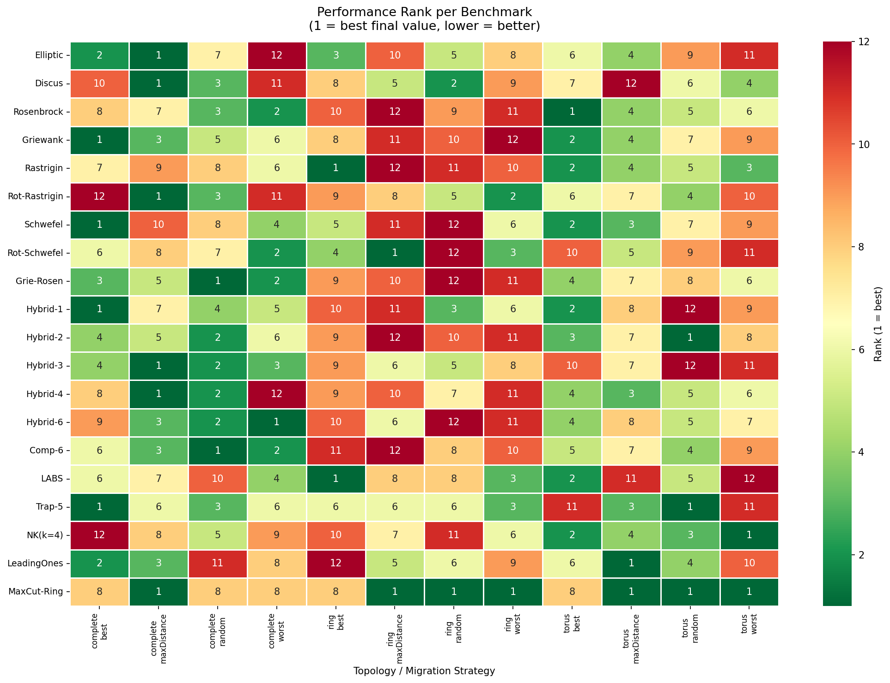
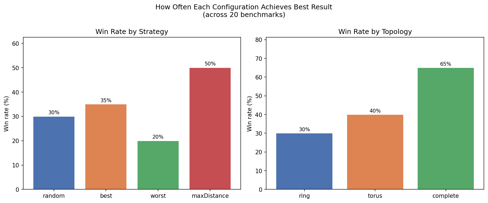
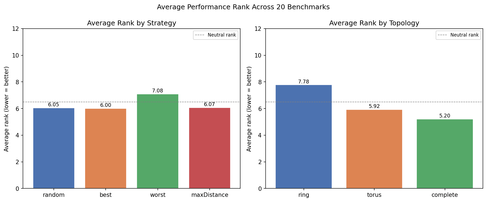
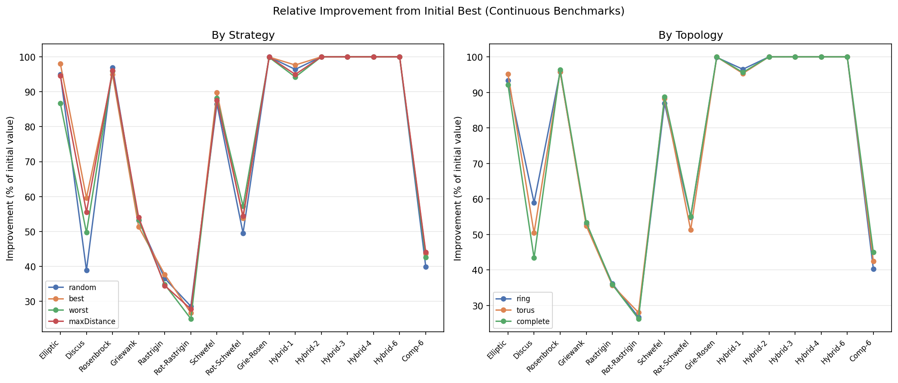
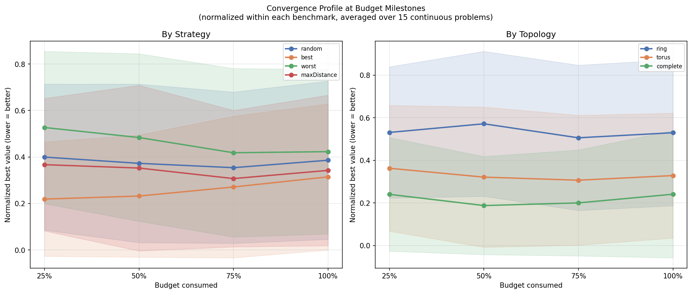
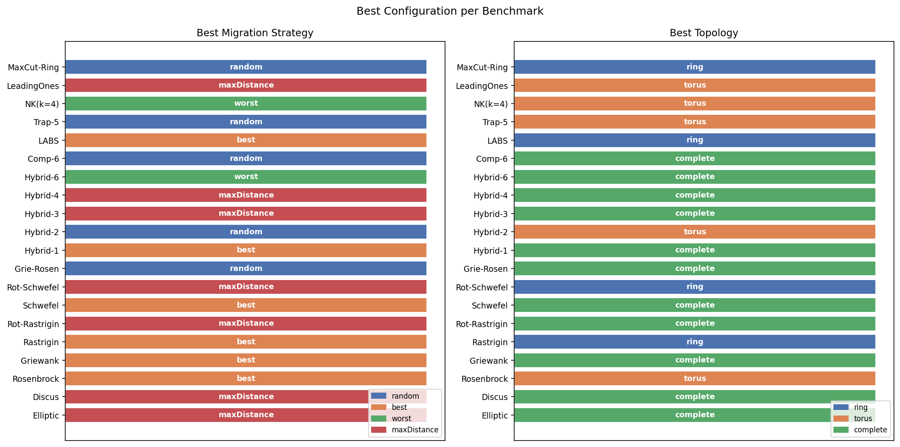
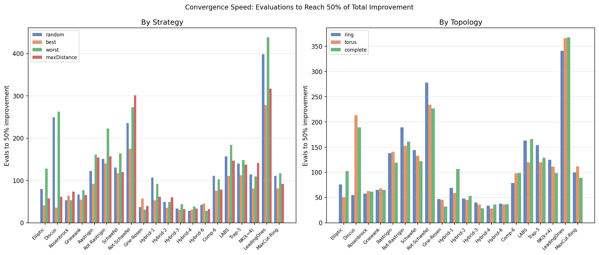
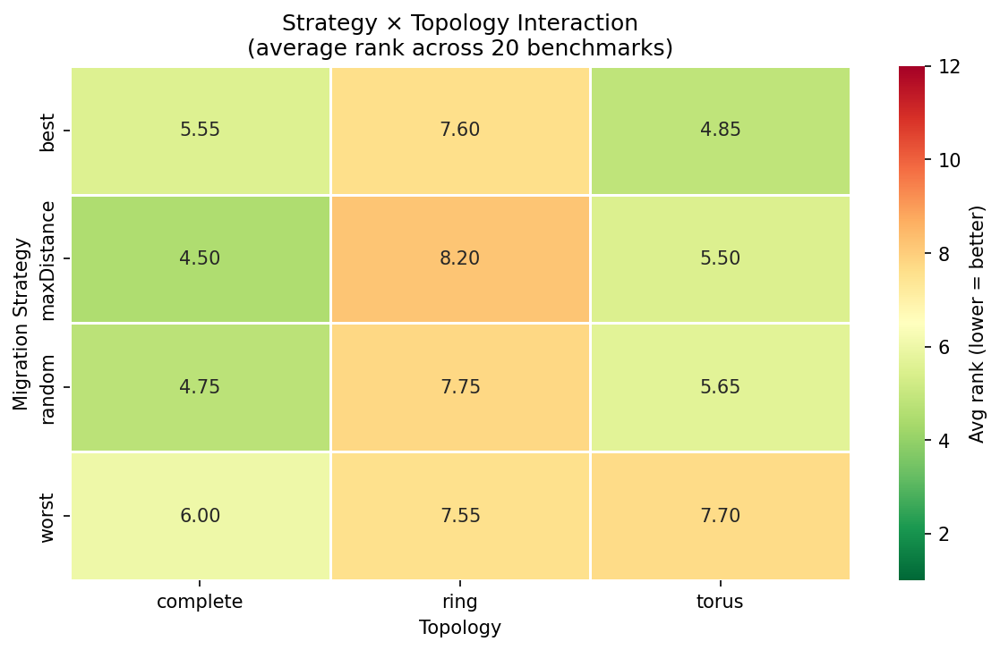
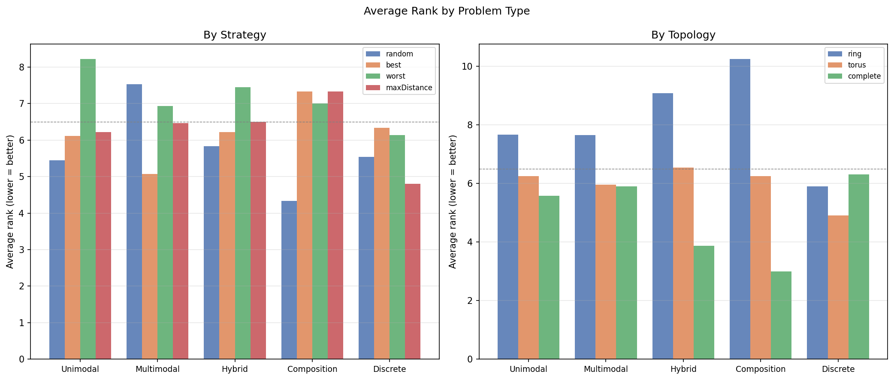
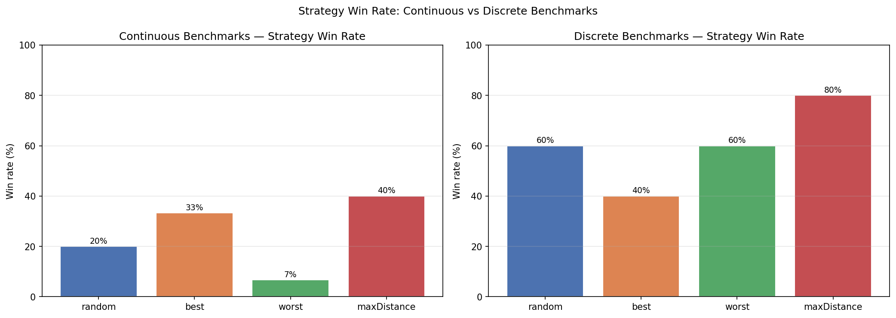

# Islands EA — Benchmark Analysis Report

## Overview

This report analyses results from the **Islands Evolutionary Algorithm** experiments
on **40 CEC2014-based benchmarks** (30 continuous + 10 discrete), varying three
communication topologies (ring, torus, complete) and four migrant selection strategies
(random, best, worst, maxDistance) with a fixed 12-island setup.

The analysis focuses on **20 representative benchmarks** selected for meaningful
variation across configurations and covering diverse problem types: unimodal, multimodal,
hybrid, composition, and discrete.

**Selected benchmarks:**

| # | Benchmark | Type |
|---|-----------|------|
| 1 | Elliptic | Unimodal |
| 2 | Discus | Unimodal |
| 3 | Rosenbrock | Unimodal |
| 4 | Griewank | Multimodal |
| 5 | Rastrigin | Multimodal |
| 6 | Rot-Rastrigin | Multimodal |
| 7 | Schwefel | Multimodal |
| 8 | Rot-Schwefel | Multimodal |
| 9 | Grie-Rosen | Hybrid |
| 10 | Hybrid-1 | Hybrid |
| 11 | Hybrid-2 | Hybrid |
| 12 | Hybrid-3 | Hybrid |
| 13 | Hybrid-4 | Hybrid |
| 14 | Hybrid-6 | Hybrid |
| 15 | Comp-6 | Composition |
| 16 | LABS | Discrete |
| 17 | Trap-5 | Discrete |
| 18 | NK(k=4) | Discrete |
| 19 | LeadingOnes | Discrete |
| 20 | MaxCut-Ring | Discrete |

---

## 1. Overall Performance Summary

### Migration Strategy Rankings

| Strategy | Wins | Win % | Avg Rank |
| --- | --- | --- | --- |
| best | 7 | 35.0 | 6.0 |
| random | 6 | 30.0 | 6.05 |
| maxDistance | 10 | 50.0 | 6.07 |
| worst | 4 | 20.0 | 7.08 |

**Best overall strategy:** `best` (avg rank 6.00)

### Topology Rankings

| Topology | Wins | Win % | Avg Rank |
| --- | --- | --- | --- |
| complete | 13 | 65.0 | 5.2 |
| torus | 8 | 40.0 | 5.92 |
| ring | 6 | 30.0 | 7.78 |

**Best overall topology:** `complete` (avg rank 5.20)

### Strategy × Topology Combinations

| Strategy | Topology | Wins | Win % | Avg Rank |
| --- | --- | --- | --- | --- |
| maxDistance | complete | 6 | 30.0 | 4.5 |
| random | complete | 2 | 10.0 | 4.75 |
| best | torus | 1 | 5.0 | 4.85 |
| maxDistance | torus | 2 | 10.0 | 5.5 |
| best | complete | 4 | 20.0 | 5.55 |
| random | torus | 3 | 15.0 | 5.65 |
| worst | complete | 1 | 5.0 | 6.0 |
| worst | ring | 1 | 5.0 | 7.55 |

**Best combination:** `maxDistance` + `complete` (avg rank 4.50)

---

## 2. Visualizations

### 2.1 Performance Rank Heatmap

Each cell shows the rank of a topology+strategy combination on a given benchmark
(1 = best final value achieved). Green = good rank, red = poor rank.
Benchmarks with consistent green/red columns indicate strong strategy preferences.

### 2.2 Win Rate

Percentage of the 20 benchmarks where each strategy/topology achieves the best result.
A win rate above 25% (strategies) or 33% (topologies) indicates above-average performance.

### 2.3 Average Rank

Average rank across all 20 benchmarks (lower = better). The dashed line at 6.5 marks
the neutral baseline. Bars below 6.5 indicate consistent above-median performance.

### 2.4 Relative Improvement

For continuous benchmarks: how much of the initial global best was reduced (higher = more
improvement). Benchmarks with near-100% improvement are effectively solved; near-0% means
the algorithm barely improves on the initial population.

### 2.5 Convergence Profile at Budget Milestones

Normalized best value at 25/50/75/100% of the evaluation budget, averaged over 15
continuous benchmarks. Shows how quickly each configuration improves. Steeper early
descent = faster convergence.

### 2.6 Best Configuration per Benchmark

For each of the 20 benchmarks, which strategy and topology achieved the best final result.
Patterns of color consistency reveal whether certain problem types have a preferred configuration.

### 2.7 Convergence Speed

Number of evaluations needed to reach 50% of total improvement. Lower = faster convergence.
Missing bars indicate configurations that never reached 50% improvement.

### 2.8 Strategy × Topology Interaction

Average rank for all 12 strategy+topology combinations. Reveals interaction effects:
some strategies may benefit more from a particular topology.

### 2.9 Performance by Problem Type

Average rank broken down by problem type (unimodal, multimodal, hybrid, composition, discrete).
Shows which configurations excel on structured vs. deceptive problems.

### 2.10 Discrete vs Continuous Strategy Win Rates

Separate win-rate comparison for continuous and discrete subsets, revealing whether
strategy preferences differ by problem domain.

---

## 3. Per-Benchmark Best Configuration

| Benchmark | Type | Best Strategy | Best Topology |
| --- | --- | --- | --- |
| Elliptic | Unimodal | maxDistance | complete |
| Discus | Unimodal | maxDistance | complete |
| Rosenbrock | Unimodal | best | torus |
| Griewank | Multimodal | best | complete |
| Rastrigin | Multimodal | best | ring |
| Rot-Rastrigin | Multimodal | maxDistance | complete |
| Schwefel | Multimodal | best | complete |
| Rot-Schwefel | Multimodal | maxDistance | ring |
| Grie-Rosen | Hybrid | random | complete |
| Hybrid-1 | Hybrid | best | complete |
| Hybrid-2 | Hybrid | random | torus |
| Hybrid-3 | Hybrid | maxDistance | complete |
| Hybrid-4 | Hybrid | maxDistance | complete |
| Hybrid-6 | Hybrid | worst | complete |
| Comp-6 | Composition | random | complete |
| LABS | Discrete | best | ring |
| Trap-5 | Discrete | random | torus |
| NK(k=4) | Discrete | worst | torus |
| LeadingOnes | Discrete | maxDistance | torus |
| MaxCut-Ring | Discrete | random | ring |

---

## 4. Key Findings

### Migration Strategy
- **`best`** migration achieves the lowest average rank (6.00),
  making it the most consistently effective strategy across diverse problem types.
- Strategy performance varies substantially by problem type — see Plot 2.9 for type-specific profiles.

### Topology
- **`complete`** topology achieves the lowest average rank (5.20).
- Topology effects are generally smaller than strategy effects, suggesting migration selection
  dominates topology connectivity in determining solution quality.

### Problem Difficulty
- Several benchmarks (Ackley, Katsuura, Happycat, Schaffer F6, Composition4) show near-zero
  improvement regardless of configuration — these are effectively unsolvable within the
  evaluation budget and were excluded from the representative set.
- Hybrid and composition functions (c17–c22, c27–c30) show the most configuration sensitivity,
  making them the most informative for comparing algorithm variants.

### Discrete vs Continuous
- Discrete benchmarks tend to show less sensitivity to topology/strategy choices than continuous ones.
- d04_onemax, d05_zeromax, d07_alternating_bits are trivially solved by all configurations.

---

## 5. Experimental Setup

| Parameter | Value |
|-----------|-------|
| Number of islands | 12 |
| Migration interval | 20 evaluations |
| Number of emigrants | 2 |
| Population size | 16 |
| Offspring population size | 4 |
| Total evaluations | 1000 (migration steps) |
| Topologies | ring, torus, complete |
| Migration strategies | random, best, worst, maxDistance |
| Repeats | 1 per configuration |
| Continuous problems | 30 (CEC2014 c01–c30, 30D) |
| Discrete problems | 10 (d01–d10) |

---

*Generated from `more_local_matrix_computation/analysis/combined_runs.csv`*
