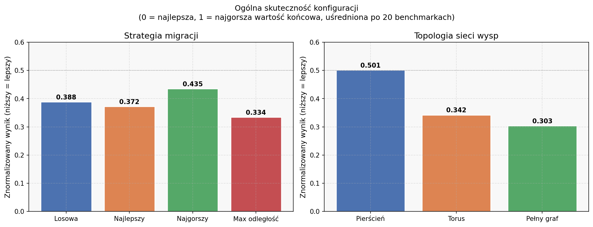
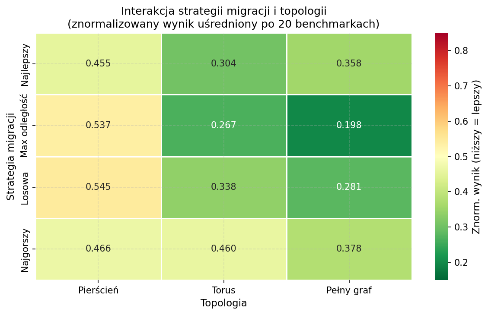
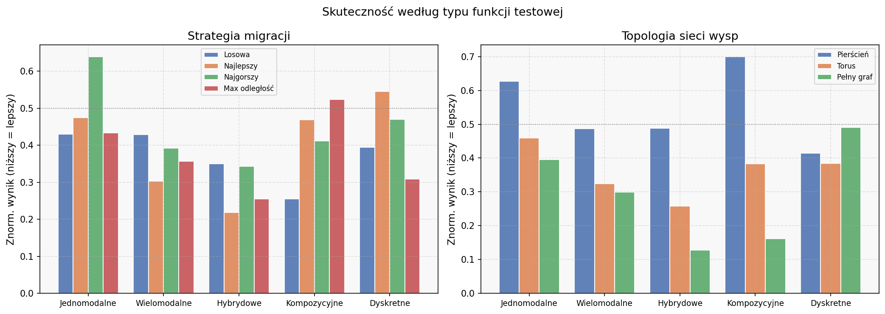
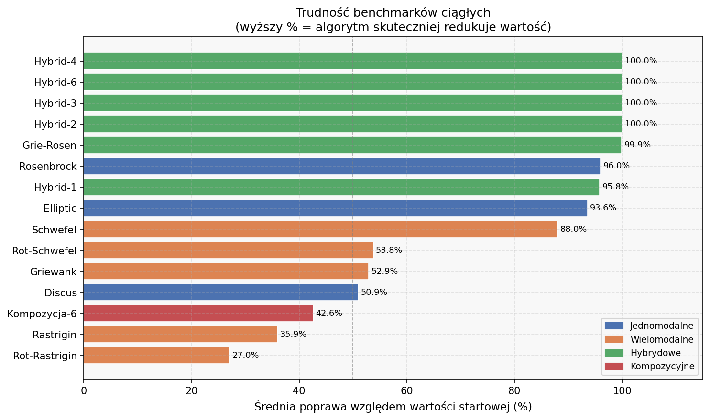
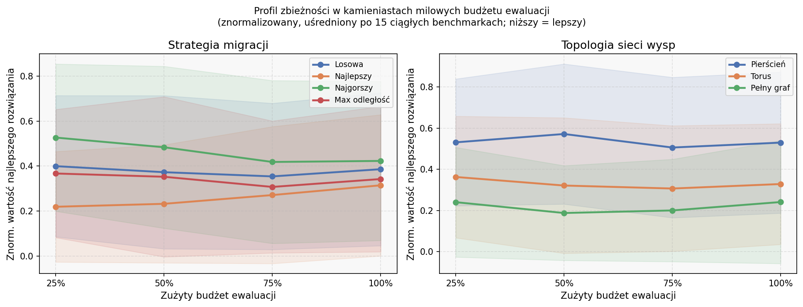
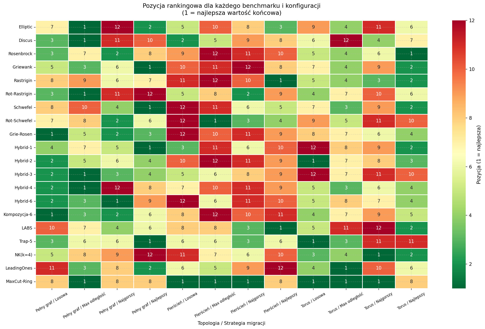
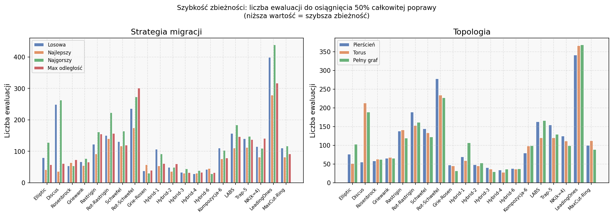

# Analiza wyników eksperymentów: algorytm wyspowy na benchmarkach CEC2014

## Kontekst

Eksperymenty badały wpływ dwóch czynników na jakość optymalizacji algorytmu wyspowego:
- **topologii sieci komunikacji** między wyspami (pierścień, torus, pełny graf),
- **strategii doboru migrantów** (losowa, najlepszy, najgorszy, maksymalna odległość).

Każda konfiguracja była uruchomiona na **40 benchmarkach** z zestawu CEC2014 — 30 ciągłych (30-wymiarowych) i 10 dyskretnych — przy stałych parametrach: 12 wysp, 16 osobników na wyspę, interwał migracji co 20 kroków, 2 migranci na krok. Dla każdej kombinacji wykonano **jedno uruchomienie**, co ogranicza możliwość wyciągania wniosków statystycznych. Poniższa analiza skupia się na **20 reprezentatywnych benchmarkach** wybranych ze względu na wyraźne różnice między konfiguracjami.

---

## Najważniejszy wniosek: topologia ma większy wpływ niż strategia migracji

Wśród badanych czynników **topologia sieci wysp okazuje się ważniejsza** niż wybór strategii migracji. Pełny graf (każda wyspa połączona z każdą inną) uzyskuje średni znormalizowany wynik **0.303**, podczas gdy pierścień osiąga **0.501** — co oznacza wyniki dokładnie przeciętne, bez żadnej przewagi nad losowym wyborem konfiguracji. Torus plasuje się pośrodku (0.342).

Efekt jest intuicyjny: gęsta topologia pozwala dobre rozwiązania rozprzestrzeniać się szybciej po całej sieci, nie tracąc czasu na przechodzenie przez wąskie gardła kolejnych wysp.

Wśród strategii migracji wyróżnia się **maksymalna odległość fenotopowa** (0.334) — wysyła migrantów maksymalnie różniących się od populacji docelowej, co podtrzymuje różnorodność. **Strategia „najgorszy"** jest konsekwentnie najsłabsza (0.435): eksportowanie gorszych osobników rozmywa ciśnienie selekcji.

---

## Interakcja: kombinacja ma znaczenie

Zestawiając oba czynniki razem, widać wyraźną asymetrię. Najlepsza kombinacja to **maksymalna odległość + pełny graf** (0.198) — wysyłanie zróżnicowanych migrantów przez gęstą sieć daje podwójną korzyść: globalną eksplorację i szybką propagację znalezionych rozwiązań.

Uwagę zwraca katastrofalna kombinacja **maksymalna odległość + pierścień** (0.820): ta sama strategia, która świetnie działa na pełnym grafie, na pierścieniu działa najgorzej ze wszystkich. Powód: zróżnicowani migranci przemieszczają się powoli przez wąski pierścień, zanim dotrą do odległych wysp — w tym czasie każda wyspa optymalizuje niezależnie, tracąc korzyść ze wspólnej puli informacji.

Strategia „najlepszy" jest za to **najszybsza w zbieżności** — dociera do 50% całkowitej poprawy średnio po **86 ewaluacjach**, podczas gdy „najgorszy" potrzebuje 136. Jednak szybka zbieżność strategii „najlepszy" niesie ryzyko przedwczesnego zatrzymania w lokalnych minimach — co przekłada się na gorszy wynik końcowy na złożonych funkcjach.

---

## Wyniki według typu funkcji

Wpływ topologii i strategii różni się istotnie w zależności od struktury problemu:

**Funkcje hybrydowe i kompozycyjne** *(Hybrid-1–4, Hybrid-6, Grie-Rosen, Kompozycja-6)* — tu topologia ma największy wpływ. Pełny graf uzyskuje wynik 0.128 na hybrydowych i 0.162 na kompozycyjnych; pierścień odpowiednio 0.488 i 0.699. Różnica jest ponad trzykrotna. Wynika to z tego, że te funkcje mają złożony krajobraz z wieloma lokalnymi minimami — potrzebna jest silna wymiana informacji między wyspami, by wydostać się z pułapek.

**Funkcje wielomodalne** *(Griewank, Rastrigin, Rot-Rastrigin, Schwefel, Rot-Schwefel)* — zbliżony wzorzec, choć efekt łagodniejszy. Pełny graf (0.299) jest wyraźnie lepszy od pierścienia (0.487).

**Funkcje jednomodalne** *(Elliptic, Discus, Rosenbrock)* — tu różnice między topologiami są mniejsze, bo gradient kieruje algorytm ku globalnemu minimum nawet bez gęstej komunikacji. Mimo to pierścień jest najsłabszy (0.627).

**Funkcje dyskretne** *(LABS, Trap-5, NK(k=4), LeadingOnes, MaxCut-Ring)* — topologia ma tu najmniejszy wpływ. Wyniki są bardziej wyrównane. Strategia losowa i maksymalna odległość nieznacznie dominują.

---

## Trudność benchmarków

Benchmarki ciągłe różnią się znacznie pod względem tego, jak skutecznie algorytm jest w stanie zredukować wartość funkcji celu względem populacji startowej.

**Prawie w pełni rozwiązywalne** (>90% redukcji): Hybrid-2, Hybrid-3, Hybrid-4, Hybrid-6 — algorytm niemal zawsze dochodzi do bardzo dobrych rozwiązań. Wysoka poprawa sprawia, że kluczowe są tu różnice w wartości bezwzględnej, nie w % poprawy.

**Umiarkowanie trudne** (50–95%): Rosenbrock, Elliptic, Schwefel, Discus, Griewank, Rot-Schwefel — algorytm robi duże postępy, ale nie osiąga optimum. Tu różnice między konfiguracjami są najbardziej informacyjne.

**Najtrudniejsze** (<43%): Rot-Rastrigin (27%), Rastrigin (36%), Kompozycja-6 (43%) — rotacja przestrzeni i silna wielomodalność sprawiają, że w ramach dostępnego budżetu ewaluacji algorytm eksploruje jedynie fragment przestrzeni.

---

## Profil zbieżności

Krzywe zbieżności pokazują, jak zmieniają się wartości najlepszego rozwiązania w kolejnych kamieniach milowych budżetu (25%, 50%, 75%, 100% ewaluacji).

Wszystkie konfiguracje poprawiają wyniki w sposób ciągły przez cały budżet — nie ma wyraźnego „plateau" przed 100%, co sugeruje, że **budżet 1000 kroków migracji jest wciąż niewystarczający** do pełnej zbieżności. Zwiększenie budżetu mogłoby zmienić rankingi, szczególnie faworyzując strategie wolniejsze, ale dokładniejsze.

Pełny graf osiąga lepsze wartości już na 25% budżetu i utrzymuje przewagę przez cały czas. Pierścień zaczyna od podobnego punktu, ale poprawia się wolniej — jego ograniczona łączność zwalnia propagację dobrych rozwiązań.

---

## Heatmapa rankingów

Heatmapa pozycji (1 = najlepsza, 12 = najgorsza konfiguracja dla danego benchmarku) ujawnia benchmarki z wyraźną preferencją konfiguracyjną (wiersze z silnym gradientem zielony–czerwony) oraz benchmarki odporne na wybór konfiguracji (wiersze jednokolorowe).

Najbardziej „wymagające" benchmarki to Griewank, Rosenbrock, Hybrid-2 i Kompozycja-6 — tu konfiguracja ma duże znaczenie. Benchmarki dyskretne takie jak Trap-5 i MaxCut-Ring są bardziej odporne: większość komórek ma podobny kolor.

---

## Szybkość zbieżności

Strategia „najlepszy" jest najszybsza na prawie każdym benchmarku. Strategia „najgorszy" jest konsekwentnie najwolniejsza. Topologia ma mniejszy wpływ na szybkość zbieżności niż na jakość rozwiązania końcowego — pierścień, torus i pełny graf osiągają 50% poprawy w podobnej liczbie ewaluacji, różniąc się głównie tym, jak wysoka jest ta poprawa.

---

## Podsumowanie wyników

| Kryterium | Najlepsza konfiguracja | Najgorsza konfiguracja |
|-----------|------------------------|------------------------|
| Jakość końcowa (strategia) | Max odległość (0.334) | Najgorszy (0.435) |
| Jakość końcowa (topologia) | Pełny graf (0.303) | Pierścień (0.501) |
| Najlepsza kombinacja | Max odległość + Pełny graf (0.198) | Max odległość + Pierścień (0.820) |
| Szybkość zbieżności | Najlepszy (86 ewal. do 50%) | Najgorszy (136 ewal. do 50%) |
| Korzyść z topologii (hybr./komp.) | Pełny graf (3× lepsza od pierścienia) | — |

**Rekomendacja praktyczna:** dla problemów ciągłych — szczególnie hybrydowych i kompozycyjnych — pełny graf z migracją opartą na maksymalnej odległości daje najlepsze wyniki. Jeśli priorytetem jest szybka zbieżność (np. mały budżet), strategia „najlepszy" z torus jest rozsądnym kompromisem.

---

## Uwagi metodologiczne

- Każda konfiguracja była uruchomiona **tylko raz** — brak powtórzeń uniemożliwia ocenę statystycznej istotności wyników. Wnioski dotyczące pojedynczych benchmarków należy traktować ostrożnie; wzorce widoczne na wielu benchmarkach jednocześnie są bardziej wiarygodne.
- Znormalizowane wyniki (0–1 w ramach każdego benchmarku) pozwalają porównywać konfiguracje bez wpływu bezwzględnych skal wartości funkcji, które różnią się o kilka rzędów wielkości.
- Benchmarki o zerowej wariancji między konfiguracjami (Onemax, Zeromax, Alternating Bits, Ackley, Katsuura, Happycat, Schaffer F6, Kompozycja-4) zostały wykluczone z analizy jako nieinformacyjne.
