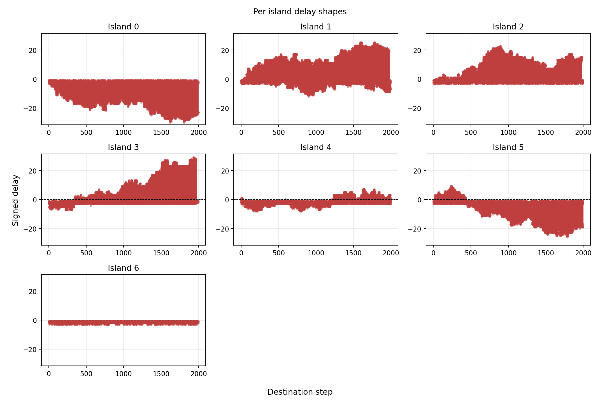
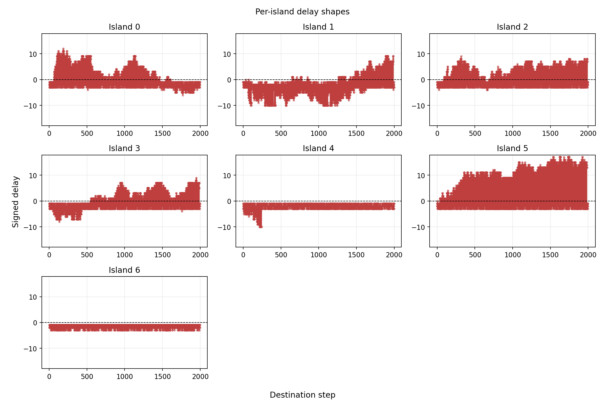

# Wykresy opóźnień na wyspach w zależności od strategii 
Poniżej przedstawiam przykładowe wykresy generowane na podstawie lokalnego uruchumienia algorytmu na 7 wyspach. Na razie bez żadnych zmian heurystyki:

## Metryka użyta na wykresach
Wykresy pokazują opóźnienie migracji liczone w krokach algorytmu:

```text
delay_steps = source_iteration - destination_step
```

gdzie:
- `source_iteration` to numer iteracji na wyspie źródłowej w chwili wysłania migranta,
- `destination_step` to numer kroku na wyspie docelowej w chwili jego odebrania.

Interpretacja:
- `delay_steps < 0` oznacza migranta opóźnionego,
- `delay_steps = 0` oznacza migranta zsynchronizowanego,
- `delay_steps > 0` oznacza migranta przyspieszonego.

Każdy panel na wykresie odpowiada jednej wyspie docelowej i pokazuje wartości `delay_steps` kolejnych odebranych migrantów w funkcji kroku wyspy docelowej.

## Potencjalne strategie przyjmowania migrantów oparte na opóźnieniach

Najprostsza strategia przyjmowania migrantów to przyjmowanie tylko migrantów nowszych niż obecna iteracja wyspy docelowej.

```text
if delay_steps > 0:
    accept migrant
else:
    reject migrant
```

Taki wariant nazwiemy `onlyNewer`. Odrzuca on migrantów opóźnionych oraz zsynchronizowanych, a zostawia tylko tych, których źródło było ewolucyjnie dalej niż wyspa docelowa w chwili wysłania. To jest bardzo agresywna polityka, bo w tych danych udział migrantów przyspieszonych wynosi tylko około `20-30%`.

Pomysły na alternatywne strategie:

- `plain`: punkt odniesienia bez filtrowania po opóźnieniu.
- `onlyNewer`: przyjmuj tylko migrantów z `delay_steps > 0`.
- `newerOrAligned`: przyjmuj migrantów z `delay_steps >= 0`
- `rejectTooOldK`: odrzucaj tylko migrantów silnie opóźnionych, np. `delay_steps < -10`.
- `delayWindow`: przyjmuj migrantów z okna `-K <= delay_steps <= A`, np. `-10 <= delay_steps <= 20`.
- `fitnessAndDelay`: przyjmuj migranta, jeśli jest nowszy od wyspy docelowej albo jeśli poprawia lokalny najlepszy fitness.
- inne warianty z ideą `SAS` - czekam na odpowiedź P. Białaszek czym docelowo miało być SAS

## Testy nowych strategii
Zaimplementowałem przykładowe strategie, dodatkowo naprawiłem strategię `best` która do tej pory nie działała poprawnie. Żeby przeanalizować, że strategie faktycznie
działają i filtrują migrantów, narysowałem wykresy opóźnienia migrantów dla każdej wyspy.

### Opóźnienia przy strategii `plain`
Przyjmujemy wszystkich migrantów.



### Opóźnienia przy strategii `rejectTooOldK`
Przyjmujemy tylko migrantów, którzy nie są silnie opóźnieni, tutaj `10` kroków czyli `delay_steps >= -10`.



# Eksperymenty `Sphere 200`:
Poniżej wyniki eksperymentów dla 150 wysp dla różnych strategii. Wykresy przedstawiają ewolucję najlepszego fitnessu w funkcji liczby kroków algorytmu.
