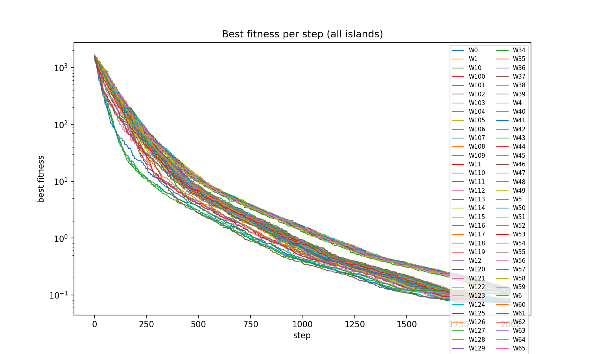
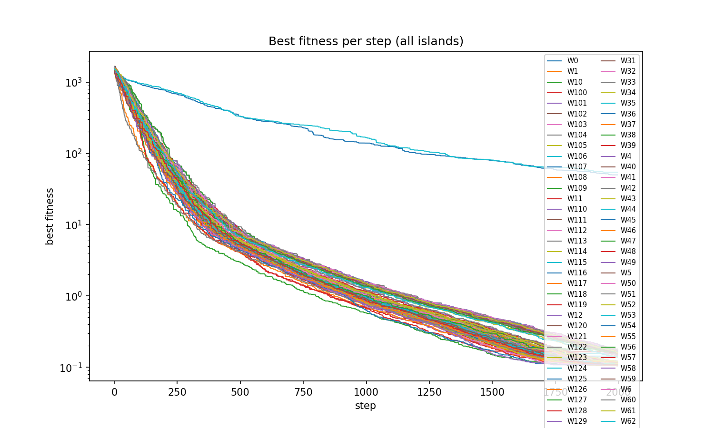
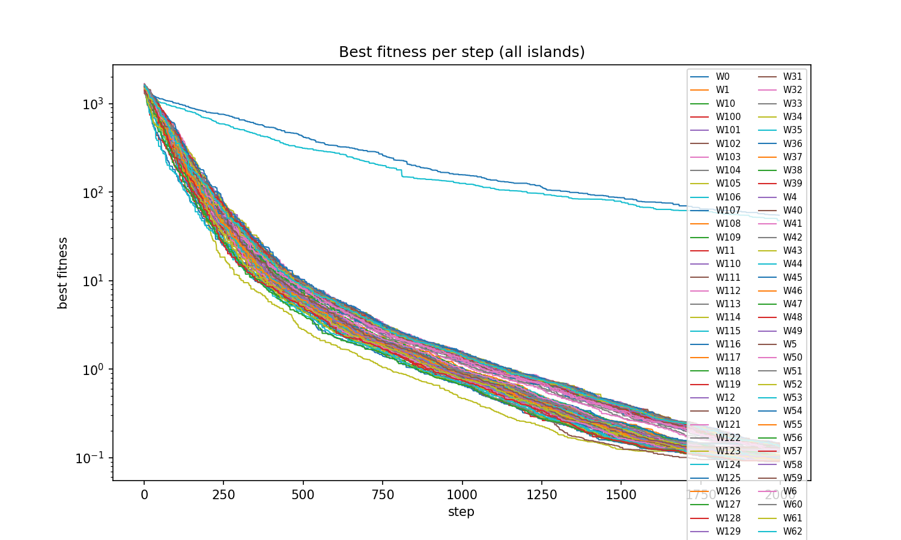
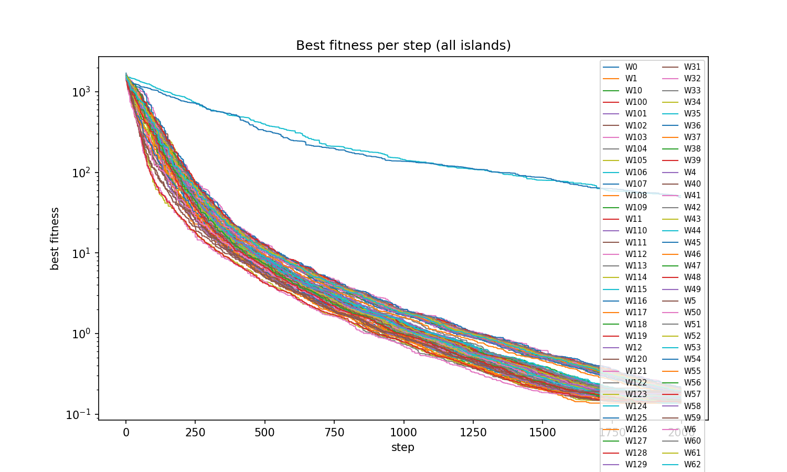

# Raport z benchmarkow modelu wyspowego

## Cel eksperymentu

Celem benchmarkow bylo sprawdzenie, jak topologia polaczen miedzy wyspami wplywa na zbieznosc asynchronicznego algorytmu ewolucyjnego uruchamianego w srodowisku HPC z wykorzystaniem Ray oraz SLURM.

Badany algorytm rozwiazywal problem minimalizacji funkcji `Sphere`. Optimum tej funkcji wynosi `0`, dlatego we wszystkich tabelach i wykresach nizsza wartosc fitness oznacza lepszy wynik.

## Dane wejsciowe

Analiza zostala wykonana na eksportach znajdujacych sie w katalogu `raport/benchmarki`. W katalogu byly rowniez kopie tych samych uruchomien, dlatego do porownania wzialem tylko unikalne serie wynikow:

- `220314_144tr_test` - topologia `torus`, 144 wyspy.
- `220723_150er1_test` - topologia `er1`, 150 wysp.
- `235703_150er2_test` - topologia `er2`, 150 wysp.
- `000626_150er2_test` - drugie niezalezne uruchomienie topologii `er2`, 150 wysp.

Dla kazdego eksperymentu wykorzystano:

- `___RESULT.txt` - wynik koncowy, srednia, najlepsza wyspa i wyniki per wyspa.
- `___WINNER.txt` - numer zwycieskiej wyspy.
- `param.json` - parametry konfiguracji zapisane przez program.
- `fitness_all_islands.png` - wykres najlepszej wartosci fitness w kolejnych krokach dla wszystkich wysp.

Wykresy dolaczone do raportu zostaly skopiowane do katalogu `raport/images`.

## Konfiguracja eksperymentow

Wszystkie analizowane benchmarki korzystaly z tej samej konfiguracji algorytmu, poza liczba wysp i topologia.

| Parametr | Wartosc |
|---|---:|
| Problem | `Sphere` |
| Liczba zmiennych | `200` |
| Liczba ewaluacji | `8000` |
| Rozmiar populacji | `16` |
| Rozmiar populacji potomnej | `4` |
| Strategia wyboru migrantow | `random` |
| Strategia akceptacji migrantow | `BEZ` |
| Liczba migrantow | `5` |
| Interwal migracji | `5` |
| Liczba probek danych na wykres | `50` |
| Interwal rysowania populacji | `500` |

Warto zaznaczyc, ze w sciezce Ray/HPC parametry `number_of_islands`, `number_of_migrants` i `migration_interval` sa przekazywane przez argumenty skryptow SLURM do `islands_desync/start.py`, a nie bezposrednio z pol `number_of_islands`, `number_of_migrants` i `migration_interval` w pliku konfiguracyjnym JSON. Dlatego za zrodlo prawdy dla wykonanych runow przyjalem `param.json` oraz `___RESULT.txt` wygenerowane w katalogach wynikowych.

## Jak czytac metryki

- `Best result` to najlepszy koncowy wynik uzyskany przez dowolna wyspe.
- `Average result` to srednia koncowych wynikow wszystkich wysp. Ta metryka mocno karze sytuacje, w ktorej pojedyncze wyspy nie zbiegnely.
- `Median` zostala policzona dodatkowo z wynikow per wyspa z `___RESULT.txt`; jest odporniejsza na pojedyncze bardzo slabe wyspy.
- `Worst` to najgorszy koncowy wynik wsrod wysp.
- `Wyspy > 1` oznacza liczbe wysp, ktore zakonczyly z fitness wiekszym niz `1`. Dla funkcji Sphere przy tej konfiguracji jest to dobry wskaznik wysp, ktore praktycznie odstaja od reszty.
- Wykresy pokazuja `best fitness per step` dla kazdej wyspy. Os Y jest w skali logarytmicznej, wiec roznice rzedow wielkosci sa widoczne bez splaszczania dolnych wartosci.

## Wyniki zbiorcze

| Run | Topologia | Wyspy | Best result | Average result | Median | Worst | Zwycieska wyspa | Wyspy > 1 |
|---|---|---:|---:|---:|---:|---:|---:|---:|
| `220314_144tr_test` | `torus` | 144 | `0.073246` | `0.096695` | `0.082049` | `0.131451` | 4 | 0 |
| `220723_150er1_test` | `er1` | 150 | `0.104244` | `0.828782` | `0.119435` | `54.385274` | 88 | 2 |
| `235703_150er2_test` | `er2` | 150 | `0.090023` | `0.799571` | `0.122962` | `54.732895` | 138 | 2 |
| `000626_150er2_test` | `er2` | 150 | `0.135229` | `0.845154` | `0.183476` | `51.546576` | 44 | 2 |

Najlepszy wynik globalny oraz najlepsza srednia zostaly uzyskane dla topologii `torus`. Topologie `er1` i `er2` potrafily doprowadzic wiekszosc wysp do sensownych wynikow, ale w kazdym z dostepnych runow mialy po dwie wyspy odstajace z fitness rzedu `50`, co bardzo pogorszylo srednia.

Dodatkowa kontrola odpornosci sredniej pokazuje skale tego efektu:

| Run | Srednia oficjalna | Srednia po odrzuceniu wysp z fitness > 1 |
|---|---:|---:|
| `220314_144tr_test` | `0.096695` | `0.096695` |
| `220723_150er1_test` | `0.828782` | `0.135058` |
| `235703_150er2_test` | `0.799571` | `0.118238` |
| `000626_150er2_test` | `0.845154` | `0.176635` |

To nie znaczy, ze nalezy usuwac odstajace wyspy z oficjalnego wyniku. Przeciwnie: pokazuje to, ze problemem topologii ER w tych runach nie jest cala populacja, tylko ryzyko pozostawienia czesci wysp bez skutecznej propagacji dobrych rozwiazan.

## Analiza wykresow

### Topologia `torus`, 144 wyspy

Dla topologii `torus` widoczna jest najbardziej rownomierna zbieznosc. Wszystkie wyspy systematycznie schodza w dol, a koncowe wyniki mieszcza sie w waskim zakresie od `0.073246` do `0.131451`.

Najwazniejsze obserwacje:

- Brak wysp odstajacych z fitness wiekszym niz `1`.
- Najlepszy wynik calego zestawu: `0.073246`.
- Najlepsza srednia: `0.096695`.
- Mediana `0.082049` jest bliska najlepszemu wynikowi, co oznacza, ze nie tylko jedna wyspa byla dobra - duza czesc wysp zakonczyla z podobnym poziomem jakosci.

Interpretacyjnie topologia torusa dala najlepszy balans miedzy eksploracja a dystrybucja informacji. Lokalna, regularna struktura polaczen nie doprowadzila tutaj do izolacji wysp, a migracje co 5 krokow z 5 migrantami wystarczyly do stabilnego rozprzestrzeniania dobrych rozwiazan.

### Topologia `er1`, 150 wysp

Dla `er1` wiekszosc wysp zbiega w okolice `0.1-0.2`, ale dwie wyspy pozostaja bardzo wysoko. Najgorsze wyniki koncowe to:

- wyspa `26`: `54.385274`,
- wyspa `125`: `49.943473`.

Przez te dwie wyspy srednia wynosi az `0.828782`, mimo ze mediana to tylko `0.119435`. Oznacza to, ze typowa wyspa zachowywala sie znacznie lepiej niz sugeruje sama srednia, ale jako caly system topologia nie byla stabilna.

Na wykresie odpowiadaja temu dwie linie, ktore przez caly przebieg pozostaja wysoko, podczas gdy reszta wysp schodzi w dol. To sugeruje, ze w tej konfiguracji czesc wysp mogla byc zbyt slabo skomunikowana z reszta grafu albo nie otrzymala wystarczajaco skutecznych migrantow przed zakonczeniem budzetu ewaluacji.

### Topologia `er2`, 150 wysp, run `235703_150er2_test`

Pierwszy run `er2` wypada lepiej od `er1` pod wzgledem najlepszego wyniku:

- `Best result`: `0.090023`,
- `Median`: `0.122962`,
- `Average result`: `0.799571`.

Podobnie jak w `er1`, srednia jest jednak mocno zawyzona przez dwie bardzo slabe wyspy:

- wyspa `90`: `54.732895`,
- wyspa `133`: `47.703532`.

Po odrzuceniu tylko wysp z fitness wiekszym niz `1`, srednia spada do `0.118238`, czyli jest znacznie blizej torusa. To pokazuje, ze `er2` potrafi znajdowac dobre rozwiazania, ale w tym uruchomieniu nie zapewnil rownomiernej jakosci wszystkich wysp.

### Topologia `er2`, 150 wysp, run `000626_150er2_test`

Drugie uruchomienie `er2` powtarza ten sam schemat: wiekszosc wysp zbiega, ale dwie pozostaja bardzo wysoko:

- wyspa `133`: `51.546576`,
- wyspa `90`: `49.084545`.

Wynik jest slabszy niz w pierwszym runie `er2`:

- `Best result`: `0.135229`,
- `Median`: `0.183476`,
- `Average result`: `0.845154`.

Powtorzenie podobnego wzorca jest istotne: odstajace wyspy nie wygladaja na pojedynczy przypadek losowy. W obu runach `er2` problem dotyczy rowniez tych samych wysp `90` i `133`, co wskazuje na mozliwy zwiazek z konkretna struktura grafu topologii `er2`.

## Porownanie topologii

Najbardziej stabilna byla topologia `torus`. Uzyskala nie tylko najlepsza pojedyncza wartosc fitness, ale tez najlepsza srednia i najnizszy najgorszy wynik. W praktyce oznacza to, ze cala populacja wysp zbiega rowno.

Topologie `er1` i `er2` zachowywaly sie inaczej. Ich najlepsze wyspy uzyskiwaly wyniki tego samego rzedu wielkosci co `torus`, ale pojedyncze wyspy pozostawaly bardzo daleko od optimum. To jest wazne, bo przy modelu wyspowym interesuje nas nie tylko to, czy ktoras wyspa znajdzie dobre rozwiazanie, ale tez czy topologia pozwala przenosic informacje przez caly system.

Wynik `er2` z runu `235703_150er2_test` jest ciekawy: najlepsza wyspa osiagnela `0.090023`, czyli calkiem blisko torusa, ale srednia zostala zniszczona przez dwie wyspy odstajace. Jesli celem byloby tylko znalezienie jednego dobrego rozwiazania, `er2` wyglada akceptowalnie. Jesli celem jest stabilna i powtarzalna praca calego ukladu wysp, `torus` wypada zdecydowanie lepiej.

## Wnioski

1. Dla dostarczonych benchmarkow najlepsza topologia to `torus`.
2. `torus` zapewnil rownomierna zbieznosc wszystkich 144 wysp bez widocznych wysp odstajacych.
3. `er1` i `er2` potrafia znalezc dobre rozwiazania na czesci wysp, ale w analizowanych runach pozostawialy po dwie wyspy z bardzo slabym fitness.
4. Wysoka srednia dla `er1` i `er2` nie wynika z tego, ze wszystkie wyspy byly slabe; wynika z pojedynczych ekstremalnych outlierow.
5. Powtorzenie problemu dla tych samych wysp w dwoch runach `er2` sugeruje, ze warto sprawdzic strukture grafu tej topologii, szczegolnie stopnie i osiagalnosc wysp `90` oraz `133`.
6. Na podstawie pojedynczych runow nie nalezy jeszcze formulowac ostatecznych wnioskow statystycznych, ale jako benchmark demonstracyjny wyniki sa spojne i czytelne.

## Ograniczenia eksperymentu

- Dla `torus` i `er1` dostepne bylo po jednym uruchomieniu, wiec nie mozna policzyc wariancji miedzy runami.
- Dla `er2` sa dwa uruchomienia, ale to nadal za malo na pelna analize statystyczna.
- Testowano tylko problem `Sphere` o 200 zmiennych.
- Nie analizowano jeszcze topologii `er3`, `er4`, `ws3`, `ws4` w dostarczonych danych wynikowych.
- Wykresy maja bardzo gesta legende, bo pokazuja wszystkie wyspy naraz. Dlatego w raporcie wazniejsza od legendy jest ogolna geometria przebiegu oraz metryki z tabel.

## Artefakty

Obrazki uzyte w raporcie:

- `raport/images/fitness_144_torus_220314.png`
- `raport/images/fitness_150_er1_220723.png`
- `raport/images/fitness_150_er2_235703.png`
- `raport/images/fitness_150_er2_000626.png`

Pelne dane z benchmarkow:

- `raport/benchmarki/plot_exports/260407/220314_144tr_test`
- `raport/benchmarki/plot_exports/260407/220723_150er1_test`
- `raport/benchmarki/plot_exports/260505/235703_150er2_test`
- `raport/benchmarki/wiecej_benchmarkuw/plot_exports/260506/000626_150er2_test`
