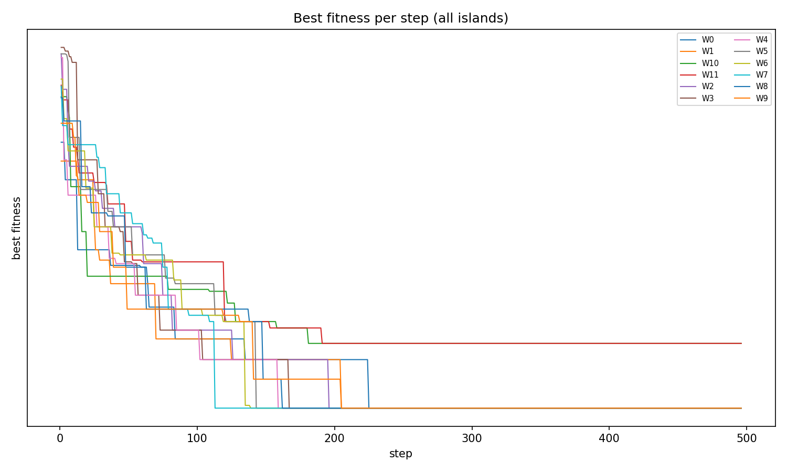

# Raport z benchmarku dyskretnego LABS

## Cel benchmarku

Celem tego benchmarku bylo sprawdzenie, czy przygotowana implementacja asynchronicznego modelu wyspowego potrafi uruchomic problem o charakterze dyskretnym, a nie tylko klasyczne funkcje ciagle typu `Sphere`.

Jako problem testowy wybrano `LABS`, czyli `Low Autocorrelation Binary Sequence`. W tym problemie szuka sie sekwencji wartosci `-1/+1` o zadanej dlugosci tak, aby jej autokorelacje dla roznych przesuniec byly mozliwie male. Im mniejsze skorelowanie sekwencji z przesunieta kopia samej siebie, tym lepszy wynik.

W praktyce benchmark mierzy, czy algorytm potrafi znalezc dobra sekwencje binarna/dwuwartosciowa i czy migracja miedzy wyspami pomaga rozpropagowac dobre rozwiazania.

## Co dokladnie zostalo uruchomione

Uruchomiony benchmark:

| Parametr | Wartosc |
|---|---:|
| Problem | `Labs` |
| Dlugosc sekwencji | `64` |
| Liczba wysp | `12` |
| Topologia | `ring` |
| Liczba ewaluacji | `2000` |
| Populacja | `16` |
| Potomstwo | `4` |
| Liczba migrantow | `2` |
| Interwal migracji | `20` |
| Strategia wyboru migrantow | `random` |
| Strategia akceptacji migrantow | `BEZ` |

Wynik pochodzi z runa HPC:

```text
RUN_DIR: logs/260506/Labs64/005945 12rr-co20ilu2
PLOTS_DIR: plot_exports/260506/005945_labs_12ring_test
```

## Jak dziala problem LABS w kodzie

Problem `Labs` jest zaimplementowany w:

```text
islands_desync/islands_desync/geneticAlgorithm/utils/myDefProblems.py
```

Najwazniejsza czesc polega na tym, ze rozwiazanie jest interpretowane jako sekwencja znakow:

- wartosc zmiennej `>= 0` jest traktowana jako `+1`,
- wartosc zmiennej `< 0` jest traktowana jako `-1`.

Nastepnie dla kazdego przesuniecia `k` liczona jest autokorelacja:

```text
C_k = suma s_i * s_(i+k)
```

Energia sekwencji to suma kwadratow autokorelacji:

```text
E = suma C_k^2
```

Na koncu liczony jest merit factor:

```text
F = n^2 / (2E)
```

Im wiekszy merit factor, tym lepsza sekwencja. Poniewaz reszta algorytmu jest ustawiona jako minimalizacja, kod zapisuje funkcje celu jako:

```text
objective = -F
```

Dlatego w wynikach wartosci sa ujemne i bardziej ujemna wartosc oznacza lepsze rozwiazanie.

## Czy to jest benchmark dyskretny?

Ten run jest dyskretny na poziomie ocenianego fenotypu, bo kazde rozwiazanie jest finalnie sprowadzane do sekwencji `-1/+1`. Trzeba jednak uczciwie zaznaczyc, ze uruchomiony wariant `Labs` jest technicznie oparty na `FloatProblem`: algorytm przechowuje wektor liczb rzeczywistych, a dopiero funkcja celu zamienia znaki tych liczb na wartosci binarne.

W kodzie dodano tez wariant `LabsBinary`, ktory jest prawdziwym problemem binarnym (`BinaryProblem`) i korzysta z operatorow `BitFlipMutation` oraz `SPXCrossover`. Ten raport opisuje jednak wynik runa `ISLANDS_PROBLEM=labs`, czyli bezpieczny wariant znakowy, ktory zostal zweryfikowany na Aresie.

Najuczciwsza interpretacja dla sprawozdania:

Prawdziwy wariant binarny jest przygotowany w kodzie jako LabsBinary, ale wymaga osobnego runa porownawczego.


## Jak benchmark jest odpalany

Wrapper HPC znajduje sie w:

```text
islands_desync/run_labs_ring_test.sh
```

Skrypt robi kilka rzeczy:

- laduje modul Pythona na Aresie,
- aktywuje venv `islands-ray`,
- tworzy katalog tymczasowy dla Raye'a,
- ustawia zmienne srodowiskowe dla problemu LABS,
- startuje Ray head node i worker node,
- wywoluje glowne wejscie:

```text
python3 -u islands_desync/start.py \
  "$number_of_islands" "$tmpdir" \
  "$number_of_migrants" "$migration_interval" \
  "$dda" "$tta" "$topolog" "$strateg" "$strateg2"
```

Wlasciwy wybor problemu dzieje sie w:

```text
islands_desync/islands_desync/geneticAlgorithm/run_hpc/create_algorithm_hpc.py
```

Tam odczytywane sa zmienne:

```text
ISLANDS_PROBLEM
ISLANDS_NUMBER_OF_VARIABLES
ISLANDS_NUMBER_OF_EVALUATIONS
ISLANDS_POPULATION_SIZE
ISLANDS_OFFSPRING_POPULATION_SIZE
```

Dla tego benchmarku skrypt ustawil:

```text
ISLANDS_PROBLEM=labs
ISLANDS_NUMBER_OF_VARIABLES=64
ISLANDS_NUMBER_OF_EVALUATIONS=2000
ISLANDS_POPULATION_SIZE=16
ISLANDS_OFFSPRING_POPULATION_SIZE=4
```

Po zakonczeniu runa wrapper kopiuje najwazniejsze artefakty do katalogu `plot_exports`: `fitness_all_islands.png`, `param.json`, `___RESULT.txt`, `___WINNER.txt`.

## Wyniki

Pelne podsumowanie koncowe:

```text
Average result:  -4.173939920795904
Best result   : -4.302521008403361
Winner island: 0 (this result was reached on : 10/12 islands)
```

Poniewaz wynik to `-merit`, mozna to przepisac bardziej intuicyjnie:

| Metryka | Objective | Merit factor |
|---|---:|---:|
| Najlepszy wynik | `-4.302521` | `4.302521` |
| Srednia po wyspach | `-4.173940` | `4.173940` |
| Slabszy wynik dwoch wysp | `-3.531034` | `3.531034` |

Koncowe wyniki wysp:

| Wyspa | Objective | Interpretacja |
|---:|---:|---|
| 0 | `-4.302521` | najlepsza grupa |
| 1 | `-4.302521` | najlepsza grupa |
| 2 | `-4.302521` | najlepsza grupa |
| 3 | `-4.302521` | najlepsza grupa |
| 4 | `-4.302521` | najlepsza grupa |
| 5 | `-4.302521` | najlepsza grupa |
| 6 | `-4.302521` | najlepsza grupa |
| 7 | `-4.302521` | najlepsza grupa |
| 8 | `-4.302521` | najlepsza grupa |
| 9 | `-4.302521` | najlepsza grupa |
| 10 | `-3.531034` | slabszy wynik, ale nie zero |
| 11 | `-3.531034` | slabszy wynik, ale nie zero |



## Co pokazuje wykres

Wykres `Best fitness per step (all islands)` pokazuje przebieg najlepszego znalezionego wyniku osobno dla kazdej z `12` wysp. Legenda `W0`, `W1`, ..., `W11` oznacza kolejne wyspy/aktory obliczeniowe.

Os pozioma to numer kroku algorytmu. Os pionowa to `best fitness`, czyli najlepsza wartosc funkcji celu znaleziona do danego momentu przez dana wyspe. Dla LABS funkcja celu jest zapisana jako `-merit`, wiec nizsza, bardziej ujemna wartosc oznacza lepszy wynik.

Linie maja ksztalt schodkow, bo wykres pokazuje najlepszy wynik do tej pory:

- gdy wyspa znajduje lepsza sekwencje, linia spada w dol;
- gdy przez jakis czas nie ma poprawy, linia jest pozioma;
- koncowy plaski odcinek oznacza, ze dana wyspa juz nie poprawiala wyniku do konca runa.

Najwieksza czesc poprawy dzieje sie na poczatku, mniej wiecej w pierwszych `100-150` krokach. Potem czesc wysp jeszcze lekko poprawia wynik do okolo `200-230` kroku, a pozniej przebiegi sa juz stabilne az do konca, czyli do okolo `500` krokow.

Na wykresie widac tez, ze wiekszosc wysp dochodzi do tej samej dolnej polki. To odpowiada wynikowi `-4.302521`, czyli merit factor `4.302521`. Dwie wyspy, `W10` i `W11`, koncza wyzej, na slabszej polce `-3.531034`. To nie sa zera; to po prostu gorszy, mniej ujemny wynik.

## Interpretacja wyniku

Benchmark zakonczyl sie poprawnie i wygenerowal komplet podstawowych artefaktow. Najwazniejsza obserwacja jest taka, ze `10/12` wysp osiagnelo identyczny najlepszy wynik. To sugeruje, ze w topologii pierscieniowej dobre rozwiazanie zostalo skutecznie rozpropagowane przez migracje.

Dwie wyspy, `10` i `11`, zakonczyly z wynikiem `-3.531034`, czyli z merit factor okolo `3.531`. Sa wyraznie slabsze od pozostalych, ale nie zatrzymaly calego runa. Srednia `-4.173940` jest blisko najlepszego wyniku, bo wiekszosc wysp zbiega do tej samej dobrej sekwencji.

Zachowanie na wykresie jest zgodne z tym podsumowaniem liczbowym: wiekszosc krzywych spada do wspolnego najlepszego poziomu, a dwie krzywe zostaja na wyzszym plateau. To pokazuje zarowno eksploracje na poczatku, jak i pozniejsza konwergencje populacji na wyspach.

Wynik `-4.302521` dla `n=64` nie powinien byc interpretowany jako globalne optimum. To pojedynczy, krotki run testowy z `2000` ewaluacji i mala populacja. Jest natomiast wystarczajacy jako dowod, ze:

- benchmark LABS dziala w sciezce Ray/HPC,
- model wyspowy potrafi uruchomic cel dyskretyzowany,
- logowanie wynikow i generowanie artefaktow dziala dla ujemnych wartosci fitness,
- migracja w topologii `ring` potrafi rozprzestrzenic dobre rozwiazanie na wiekszosc wysp.

## Co sprawdza ten benchmark

Ten benchmark sprawdza kilka rzeczy jednoczesnie:

1. Czy sciezka HPC potrafi uruchomic inny problem niz domyslny `Sphere`.
2. Czy kod potrafi optymalizowac problem dwuwartosciowy `-1/+1` bez zmiany calej infrastruktury.
3. Czy negatywna funkcja celu (`-merit`) nie psuje selekcji, migracji ani raportowania.
4. Czy topologia `ring` przenosi dobre rozwiazania miedzy wyspami.
5. Czy automatyczne eksportowanie `param.json`, `___RESULT.txt`, `___WINNER.txt` i wykresow jest odporne na nowy benchmark.

## Znaczenie zmian w kodzie

Zeby benchmark dyskretny dal sie sensownie uruchomic, dodano/naprawiono kilka elementow:

- `create_algorithm_hpc.py` umozliwia wybor problemu przez `ISLANDS_PROBLEM`, bez recznego przepisywania kodu przed kazdym runem.
- `myDefProblems.py` zawiera aktywny `Labs` oraz przygotowany `LabsBinary`.
- `plot_all_islands.py` wykrywa wartosci `<= 0` i uzywa skali `symlog`, bo zwykly `log` nie dziala dla ujemnych wartosci fitness.
- `genetic_island_algorithm.py` zapisuje nazwy operatorow bez zalozenia, ze obiekty operatorow sa dostepne pod jedna konkretna nazwa atrybutu.
- obsluga rozwiazan binarnych zostala rozszerzona tak, aby mozna bylo testowac `LabsBinary` w kolejnych runach.

## Ograniczenia

Najwazniejsze ograniczenia tego konkretnego benchmarku:

- To jeden run, wiec nie wystarcza do statystycznego porownania topologii.
- Uruchomiony wariant `Labs` jest dyskretyzowany przez znak zmiennej, ale nie jest jeszcze czystym runem `BinaryProblem`.
- Do lokalnego raportu pobrano gotowy `fitness_all_islands.png` i podsumowania tekstowe, ale nie pelne surowe pliki `resultsEveryStepW*.json`, wiec nie przeliczano wykresu od nowa lokalnie.
- Wynik nalezy traktowac jako walidacje dzialania benchmarku dyskretnego, a nie jako ostateczna ocene jakosci algorytmu dla LABS.
